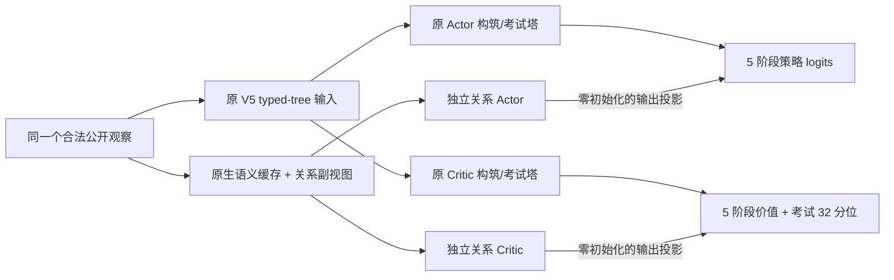

# V6 关系编码：从现有权重继续联合训练

日期：2026-09-18。代码分支：`codex/relational-v6`。

本版把公开卡牌程序、固有/P-item、回忆触发、Buff、回合、牌区、构筑预算及候选动作关系接入一个可学习的新分支；保留 V5 的完整 Actor/Critic 与所有旧权重。仍联合训练选卡、指导强化、饮料、回忆和考试。没有外部教师，没有新增手写打法奖励。

**这是架构热启动，不是旧实验的精确续跑。** 第一次切换必须使用新目录和 `--initial`。本次本地验收不代表 Ascend 新模型的算子覆盖、吞吐、内存峰值或长期策略质量已通过；必须在原有可用环境做下面的单卡/多卡预检。无需为本改动升级 CANN、torch_npu 或驱动。

## 1. 新模型具体增加了什么



标准宽 96、词编码 16、旧塔深度 4、新关系塔深度 2、32 分位时：旧模型 2,041,162 参数，新 Actor 1,315,113，新 Critic 1,207,433，总计 **4,563,708**。源 checkpoint 若使用其他宽度，迁移会沿用源宽度，不能用这个参数量反推所有 checkpoint。

| 模块 | 输入及用途 | 重要边界 |
|---|---|---|
| 13 类实体 adapter | global/card/P-item/drink/memory/program/state/event/time/zone/constraint/candidate/counter | 每个实体保留身份域，支持多个固有卡、多个 P-item；并非每位偶像单独一套模型 |
| program encoder | 有顺序的条件、成本、动作、触发程序，以及成长 overlay、绿豆前后形态 | 不把两次打分并成一次，不把两个独立 Buff 添加语句相加 |
| state encoder | 公开 Buff 数值、持续/次数状态、体力等 | 不创造隐藏信息，也不把未知字段假定为零 |
| event encoder | 来源、触发阶段、次数、延迟、存续时间及共享计数作用域 | 效果调度 group 不等于共享触发次数；无法确定的语义保留 unresolved |
| time encoder | 完整公开回合顺序、当前位置、回合倍率与剩余进程 | 用户已确认开局能看到完整顺序；不提供隐藏抽牌顺序或 RNG |
| zone encoder | 已有卡组、手牌/牌库/弃牌/移出区域、公开顺序及持有量 | 固定卡和候选 selected_count 去重；候选池不等于已持有卡组 |
| constraint encoder | 卡数、重复/唯一/互斥、P 点、免费指导、支援卡与饮料/回忆容量 | 游戏合法性仍由原环境决定，神经网络不能绕过 action mask |
| receiver gate | 同时看发送者、接收者和关系类型，再聚合消息 | 稀疏显式关系；没有全实体两两注意力 |
| candidate query | 每个合法动作查询当前场景的实体 | 复杂度随动作数×实体数增长，动作顺序与原 mask 一致 |

例如绿豆 37 去掉局内一次时，四栏效果 AST 可能完全不变。新增 `effective_traits` 单独记录正常用后的去向、有效次数限制及强制初始牌等；`holdThis` 等运行时规则仍保留在程序中，不能用静态去向覆盖。临时支援强化优先使用观察里的实际 effective，不能用基础缓存抹掉临时效果；缺失的临时 traits 会明确标记未解析。

原生桥复用本仓库绑定的 JS 编译/卡牌组合逻辑，不启动考试、不推进 RNG。预编译全目录基础卡及五个场景可达指导形态，只是提供语义字典，**不会扩充合法候选池或绕过 PLv、流派、禁卡、份数、绿豆预算限制**。当前模型输入没有被提升为新的活动周模拟器；多个机制来源能共存，不等于活动周完整规则已验收。

新副视图对运行时效果分配 ID 做匿名关联，不把其数字大小当强弱；共享次数关系仍保留。为保持迁移时的旧函数，旧分支输入未重写，其中历史 `state.triggeredEffect` 的嵌套分配 ID 仍可能作为无关数值出现。因此本轮验证的是**新关系副视图**的分配 ID 重命名不变性，不宣称整个双分支网络已经满足这个性质。它不提供隐藏牌序，但属于后续可单独消融的旧编码缺口。

## 2. 保留的训练目标和底层实现

- 保留五偶像均衡场景与现有合法构筑约束；配置继承仓库的 `search-v5.json`，不是对当前远端运行配置的自动读取。
- 保留同构筑四局、Best-of-4 目标、leave-one-out 考试贡献、32 分位基线、公开历史 MCTS、PPO/搜索标签分离、KL 停止与独立价值补训。
- 保留末局高分目标。没有把此模型改成完整培育，也没有加入跨下一场考试的资源保留奖励。
- 保留原设备选择、Ascend portable GRU、pool、HCCL/Gloo、分布式梯度规约、分片采样及优化器设备选项；本版没有修改这些底层适配。
- 旧参数按名称及形状严格迁移；Adam 一二阶矩按名称匹配，不能凭位置迁移。新增模块只有最终输出层为零，内部网络正常初始化，因此首步先学输出层，之后梯度进入内部层。
- 不搬运旧 PPO 轨迹、旧概率、旧搜索标签、旧计数/随机状态或旧排行榜作为新实验状态。新实验在新版本下建立自己的固定测试基线。相同 V6 版本内的 `--resume` 才恢复这些状态。

新配置先将旧模块 LR 乘 0.25，按 **8 个完成批次**线性恢复到基础 LR；新模块使用基础 LR。这样慢速初始评估不会耗光适配窗口。基础 LR 日程仍继承 V5：0.0005，120 分钟保持，再用 2880 分钟衰减到 0.2 倍。两个计划相乘，适配完成不会取消基础衰减。实际 7 组 LR 写入 `optimizer-change.json` 和进度中的 `optimizer_schedule`。

## 3. 准备一个独立部署目录

已有训练读取的源码目录不要原地 `git pull`。训练有源码/引擎/配置指纹保护；修改它会使后续检查点封存失败。可让旧作业继续作为基线，在新目录准备 V6。不要在同一组设备上直接并发启动两个满负载训练。

```bash
git clone --branch codex/relational-v6 https://github.com/RedStoneManL/gakumas_personal.git gakumas-v6-src
cd gakumas-v6-src
git rev-parse HEAD
python rl/hif-colab/build_training_bundle.py --target ascend
python -m zipfile -e rl/training/artifacts/ascend/gakumas-ascend-training.zip ../gakumas-v6-deploy
cd ../gakumas-v6-deploy
```

后续命令均在 **新部署包根目录**，使用服务器已经可用的 Python/CANN 环境。保留原环境的启动变量和网卡设置，本说明不替换它们。

从旧运行选择一个**已经完整写出**的 checkpoint：通常用稳定的 `best4.pt` 或最近完整的 `latest.pt`，记录路径和 SHA。如果服务器已经训练过很久，应使用服务器的权重；仓库附带的 `checkpoints/latest.pt` 是历史发布快照，不是远端最新权重。不要复制仍在写入的 `.tmp` 文件。

```bash
INITIAL=/absolute/path/to/old-run/best4.pt
sha256sum "$INITIAL"
python exam-search/prepare_relational.py
```

生成 `exam-search/setup/relational_semantics.json`。当前五 profiles 编译约 2207 个卡形态和 106 个 DSL 程序，约 2.34 MiB；数字会随目录更新。输出必须 `rng_calls_delta: 0`。缓存与本部署的 native 源码及桥代码绑定，默认不放进 Git/部署包。**每份部署独立生成**；版本不符或未准备的卡形态在运行时会明确报错，不会逐卡启动 Node 或悄悄退回缺失编码。新增合法场景/绑定声明后重新准备，可用 `--extra public_entries.json` 补充公开输入。

## 4. 先验收，再长训练

```bash
# 回归：不启动正式训练作业
python ascend/run_tests.py

# 新模型专用短预检：真实短局 + MCTS + 反向/Adam + RNG恢复
python ascend/preflight_search.py --device npu --relational \
  --initial "$INITIAL" --output ../gakumas-evidence/v6-1npu.json

# 原设备doctor不变
python ascend/doctor.py --expected-npus 8 --output ../gakumas-evidence/v6-environment.json

# 同样的新模型/输入，检查现有多卡通路
torchrun --standalone --nnodes=1 --nproc-per-node=8 ascend/preflight_search.py \
  --device npu --relational --initial "$INITIAL" \
  --output ../gakumas-evidence/v6-8npu.json
```

短预检通过并不代表所有五种复杂牌组都能高速运行。再用单卡小配置完成**一个完整联合训练批次**，检查从选卡到打牌及写盘恢复的完整链路：

```bash
python exam-search/train.py --config ascend/configs/search_v6_smoke.json \
  --initial "$INITIAL" --output ../gakumas-runs/v6-smoke
```

该配置 `max_batches=1`，结束后仍有收尾评估，因此不是一分钟计时测试。五个角色、原生结束条件和搜索有效标签门槛保留，场景库回放/固定牌组大评估仅在烟雾配置关闭以缩短检查。正式模板保留原 V5 的完整评估。

应检查：

1. `manifest.json` 的 `model_config.relational=true`、参数数目和 semantic SHA；`transfer.optimizer_migration` 有已复制旧参数与新参数记录。
2. `optimizer-change.json` 有 7 组 LR；`latest.pt` 的模型 schema 为 `arena-joint-relational/1`，输入版本为 `arena-generalist-build-exam/4`。
3. `search-roots.jsonl` 中有效根确实生成标签，无效/超时根继续被拒绝；没有语义缓存 miss 或 sideview/mask 不匹配。
4. 完成至少一次 PPO/搜索更新和一次检查点写盘；actor/value 参数有限；critic-only 补训没有改变 Actor。
5. 实测 NPU/主机峰值内存、collect/update/评估耗时；不能只用参数量估算速度。新 draft 关系图实体数明显增加，特别指导动作也可能多。

## 5. 正式配置与启动

正式模板 `ascend/configs/prod/search-v6-relational.json` 基于 V5。资源起点：8 learners、全作业 384 Arena workers、384 搜索 roots；推理合批 16、每卡 PPO 微批 16、全局有效优化批量 1024、每采样批软预算 32768 决策。保留 V5 的 5760 分钟窗口（96 小时）作为模板值；这份提交本身没有启动任务。

微批/推理合批从 V5 较大的配置下调，是为了新关系图的容量验收；不是 NPU 的固定上限。通过实测后可以增大。不要为了增加微批改变全局有效批量或 best4 目标。先看更新吞吐和搜索等待，再逐步调资源。

```bash
CONFIG_DIR=../gakumas-configs/v6-run1
python ascend/configure.py --output-dir "$CONFIG_DIR" \
  --search-base ascend/configs/prod/search-v6-relational.json \
  --learners 8 --workers 384 --search-workers 384 --inference-batch 16 \
  --batch-decisions 32768 --minibatch-size 1024 --microbatch-size 16 --torch-threads 4
LEARNERS=$(python -c 'import json,sys; print(json.load(open(sys.argv[1]))["learner_world_size"])' "$CONFIG_DIR/search.json")

torchrun --standalone --nnodes=1 --nproc-per-node="$LEARNERS" exam-search/train.py \
  --config "$CONFIG_DIR/search.json" --initial "$INITIAL" \
  --output ../gakumas-runs/v6-main
```

`configure.py` 同时产生完整培育配置，但上述命令只启动本搜索训练模型。环境原来的 dashboard 入口仍可使用：

```bash
python dashboard/server.py --run ../gakumas-runs/v6-main --port 8900
```

新输出目录、新配置和源码/语义产物确定后，再开始训练。不要复制旧输出目录假装延续同一个固定基线。

## 6. 如何评估这次升级

一开始零残差的策略应与源模型一致，而不是一启动就加分。后续按每位偶像、固定课程/倍率、饮料容量、HIF/无 HIF 分层看：

- 相同固定测试下的 mean、Best4、离散程度和通过情况；新旧模型若比较原始分数，必须重跑相同条件与种子，不能直接比较各自重新归一化的指数。
- 固定构筑的打法是否进步，以及自由构筑是否进步，分别看；构筑进步不能从一次好运单局推断。
- 饮料剩余、Buff 铺垫/打分时机、固有/P-item 实际触发和次数、关键绿豆卡循环是否改善。
- 探索覆盖、action entropy、KL、各阶段梯度与价值误差；通过 `gradient_diagnostics` 的 actor 梯度统计已包含新关系分支。
- 同等墙钟预算下有效样本数、有效搜索根比例、更新次数及固定验证质量。新网络更大不等于训练更快，关系图更丰富也不保证能提升。

建议在 1、4、8 个批次和随后每 2–3 小时比较趋势。先判断接入是否稳定，再看策略质量；不要因一批分数下降就覆盖原 best4 权重。若新模型明显退化或资源不可承受，可回到保留的旧部署和完整 checkpoint。

## 7. 停止、恢复和版本边界

```bash
# 完成当前批次后保存并收尾
printf '{}\n' > ../gakumas-runs/v6-main/stop-after-batch.json

# 后续同版本/同配置/同卡数恢复前，删除自己创建的停止标记
rm ../gakumas-runs/v6-main/stop-after-batch.json
torchrun --standalone --nnodes=1 --nproc-per-node="$LEARNERS" exam-search/train.py \
  --config "$CONFIG_DIR/search.json" --output ../gakumas-runs/v6-main --resume
```

不要用 `--resume` 或 `--continue-from` 跨 V5→V6 架构边界。V6 的相同版本恢复保留模型、Adam、已完成批次、随机状态、样本库和基线；改源码、语义文件、场景或模型结构需另做显式迁移。最新本地验收结果见同目录的 `RELATIONAL_V6_ACCEPTANCE.md`；服务器真实预检结果应另外保存，不能把 CPU 结果改写成 NPU 已通过。
