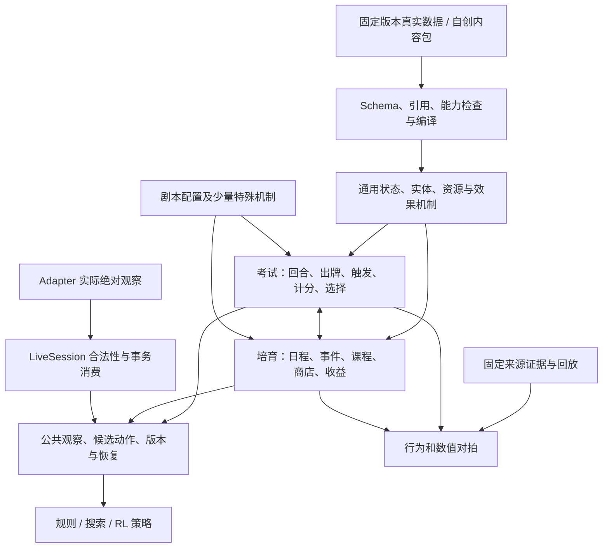

# 完整 Arena 的设计与完成标准

> **2026-09-09 当前入口更新：**用户指定 gakumas-tools 为局内规则 golden；已直接纳入原始源码与数据，新 `gakumas_arena.create_exam` / `gakumas_arena.engine` 可运行。旧 HIF/Gym/Content/live 路径仍兼容，未整体改接；范围、验证和下一步迁移见 [ARENA_GOLDEN_ENGINE](ARENA_GOLDEN_ENGINE.md)。

2026-09-08。目标是可供程序完整游玩的无 UI 学園アイドルマスター，规则以 1:1 为验收方向。RL 选型由独立 agent 研究，见 [交接](RL_DESIGN_HANDOFF.md)；本路线图不依赖选定神经网络或训练平台。

**本阶段范围：HIF优先。** 按用户2026-09-08最新要求，先验证HIF共用机制与实际可取得内容；偶像之路专属麻烦（如パニック）及其他偏门跨模式组合暂缓，不作为HIF完成条件。真实编成采样见 [HIF操作清单](RULE_ALIGNMENT_REAL_CARD_RECIPES.md)。这调整当前顺序，不删除通用引擎已有能力，也不将暂缓机制标为已验证。

**同批排序取舍**：道具／状态附魔先按稳定ID字典序执行，细粒度同批或跨阶段次序暂缓校准；已有差异留证，不要求穷举或阻塞HIF。继续优先通用机制、合法性、状态消费与完整培育流程，见 [默认政策](ARENA_TRIGGER_ORDER_UPDATE.md)。

**同日规则实施更新**：[底层对齐交付](ARENA_RULE_ALIGNMENT_UPDATE.md) 已完成集中／好印象强化路径、批次资格、阶段／费用顺序、自动用卡边界及状态寿命和来源修正。17项定向探针符合报告；后续按 [采样清单](RULE_ALIGNMENT_LOG_REQUESTS.md) 确认歧义，再扩大真实内容对拍。handler覆盖与离线运行数仍不能作为机制1:1证据。

## 分层与约束

游戏状态推进与策略目标分开：Arena 不依赖“想拿什么分”的奖励函数才能正确执行动作；效果处理器只实现一次，供所有卡牌、道具、事件和剧本引用。训练 wrapper 可以定义奖励，但不能重算或修改游戏规则。

静态定义与实体分开：同名卡的两个副本有独立身份、强化、自定义、成长和触发次数；移区不换身份。固定主数据描述可能机制，已观察状态描述当前事实，不能用前者推断缺失的后者。

实况与模拟共用规则和编码语义，但状态来源不同：模拟可以运行转移；实况只在实际确认后消费新绝对状态，提交或不确定结果不提前扣资源。

## 当前状态及下一顺序

| 阶段 | 当前基础 | 接下来完成什么 | 完成证据 |
|---|---|---|---|
| 1. 资源与机制 | 体力/元气/状态/费用、效果/条件/搜索/成长注册表；原生考试结算 | 补未消费的机制字段，检查同机制不同来源及嵌套顺序 | 独立数值向量、真实定义测试、来源明确的实机对拍 |
| 2. 实体与选择 | 区域、实例、多选、连续选择、暂停和恢复 | 卡牌进入区域时的触发；剩余预约/再演/卡绑定动态语义 | 进入/未进入、双副本、嵌套及恢复；绝不通过自动选牌掩盖选择边界 |
| 3. 培育生命周期 | ProduceRuntime 和自创流程支持事件/课程/商店/卡牌收益与资源 | P 道具取得/替换/次数/间隔/周次钩子，支援技能/回忆等跨阶段一致性 | 同一道具不同阶段的前后状态、触发次数和日志对拍 |
| 4. 官方内容与剧本 | 全量物品目录、初/NIA/HIF 旧路线装配；自创流程可执行 | 固定来源批量导入真实事件/商店池/课程配置；官方路线逐段迁移数据包 | 完整分支清单、选项/成本/收益来源、未知概率清单；避免手写每个事件 |
| 5. 全局决策接口 | 培育、考试、实况各有公共入口 | 提供贯穿培育与考试/中间选择的一致决策协议，精确结束原因、计数与可见性 | 相同动作日志跨保存恢复一致；一次完整合成培育可全程由外部程序选择 |
| 6. 保真与运行质量 | 既有录像回归、来源哈希和机制准入 | HIF 明星性/属性倍率/NPC/隐藏概率校准；批量模拟、快路径及基准 | 证据覆盖与机制覆盖分开统计；吞吐、峰值内存、确定性对比 |

本轮先交付阶段 2 的“自身移区效果”，见 [字段/示例/边界](CARD_MOVEMENT_CONTRACT.md)。接下来优先阶段 3 的通用 P 道具培育生命周期，再迁移真实事件与官方路线。需要实机补证的排序/概率项目并行登记，不填猜测值冒充已验证规则。

## 统一状态与决策设计应保持的语义

- 资源：单位、上下限、代价支付时点、整数/小数及取整位置；费用和收益不能作为无法区分正负的同一字段。
- 效果：来源实体、作用对象、条件、阶段、参数、有序子效果、持续回合、次数、间隔；同种机制参数化复用。
- 计数：培育步骤、考试回合、玩家行动窗口、实际出牌次数、自动使用/重复结算分开。内部选择页不擅自增加游戏时间。
- 决策：稳定候选身份、候选内容、规则合法性、最少/最多选择数、是否允许重复/跳过；非法或过期动作不能部分提交。
- 结束：中间考试结束、该阶段通过/失败、路线结束和模拟时间截断分别表示，保留后续培育要用的体力、卡组、道具与结果。
- 可见性：公开事实、完整已知集合、未知集合/数值、隐藏牌序/RNG 分开。调试用完整 runtime 不能直接成为部署策略的输入。
- 恢复：数据/规则/内容/编码版本、RNG 与选择日志一致；实况另外保留原 command_id、submitted/uncertain 阻塞和去重账本。

RL agent 应在这些语义上提出张量/模型需求。旧候选编码丢失效果数值的问题仍需版本化处理，不能只用卡牌 ID 或结构哈希代替可解释机制输入。

## 不把不同的“完成”合成一个覆盖率

每条机制/内容至少分别报告：

1. **已收录**：来源、版本、字段与依赖齐全。
2. **可执行**：必要处理器/生命周期存在；未知或不支持的项显式拒绝。
3. **离线验证**：测试实际触发了目标路径，有独立预期；只跑通未触发的卡另记。
4. **真实对拍**：证据给出可观察前后状态、版本、触发条件和误差；片段证据不能替代整个剧本认证。

“全部基础设施完成”需要：所有声明支持的决策有程序入口，规则/生命周期无静默遗漏，别人可以创建新卡/道具/事件/课程/试镜/剧本，完整流程可暂停恢复，并且以上未验证清单清晰可查。

“游戏 1:1 完成”还需要官方路线/事件池及其选择条件、费用/奖励、考试规则、随机分布和结算版本都有足够证据。当前仍未达到这一层，不因目录条目数或合成通过率提前宣告完成。
