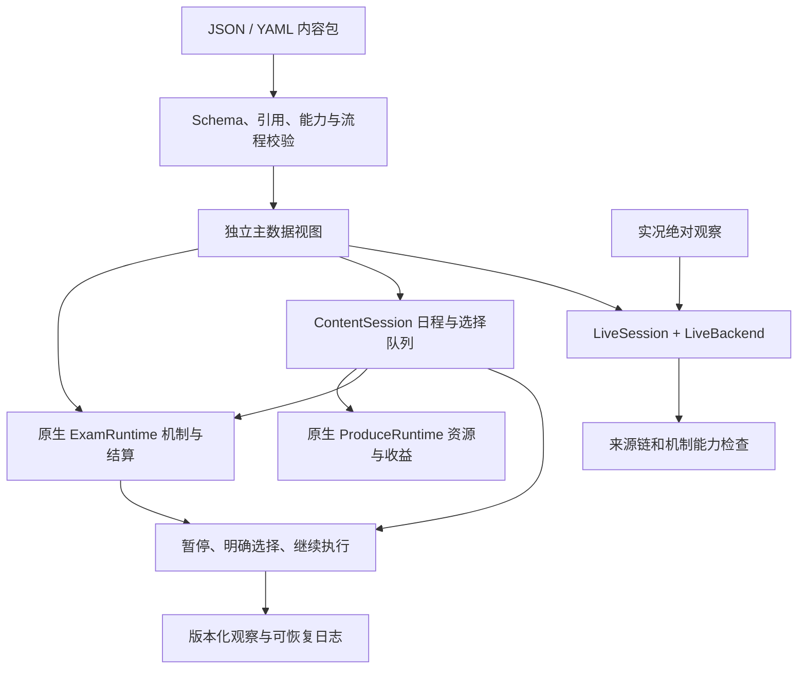

# 数据驱动基础设施：实现与边界

2026-09-08 增量：新增 `Card.on_move` 与原生卡牌自身移区效果；内容规则签名升级 `arena-content-rules/2`，完整迁移/验收见 [ARENA_MOVEMENT_UPDATE.md](ARENA_MOVEMENT_UPDATE.md)。后续设计标准见 [完整路线图](ARENA_COMPLETION_ROADMAP.md)。

新内容的权威入口是 `gakumas_arena.content`，契约 arena-content/1；创建流程见 [CONTENT_AUTHORING.md](CONTENT_AUTHORING.md)。

## 已落地的职责

| 组件 | 职责 |
|---|---|
| content/models.py | 卡牌、效果、成长、筛选、触发、被动、事件、训练、试镜、剧本的版本化 Schema |
| content/operations.py | 参数模型与机制编译注册表；可显式扩展，数据包不能执行代码 |
| content/compiler.py | 聚合错误、引用及变体检查、图循环检查、命名空间隔离、原生表编译 |
| content/exam.py | 复用原生结算，增加可恢复的明确选择和自创考试参数 |
| content/flow.py | 通用流程图、条件、成本、效果队列、奖励和容量选择、课程与试镜接续 |
| content/__main__.py | 创建模板、校验、目录、Schema、检查定义、导出、完整合成演示 |
| content/capabilities.py | 以机制类型检查被动能力，替代新增具体 ID 的准入分支 |
| live/passive_generic.py | 实况来源链／动态状态校验，保持绝对观察消费模式 |
| simulation/exam/structural_encoding.py | 通用被动／效果结构编码；与旧模型显式分版本 |

## 选择与恢复

自创考试的 select 使用完整候选集合。第一次需要玩家选择时暂停；取得答案后，从该动作之前的完整状态重放，沿用原 RNG 和已选实例，直到下一个边界或动作结束。
被重放的纯引擎计算没有外部副作用，因此费用与增益不会叠加消费。测试覆盖连续两次选择、中间保存恢复、非法输入和原动作继续。
流程图以显式队列保存后续效果与节点跳转，后续选择完成前不会进入下一节点。
公开快照保存版本化指令日志，重新编译相同内容后可恢复；不序列化 Python pickle 或调用外部执行器。

LiveSession 继续负责 submitted/uncertain 原命令、事件去重和实际结果快照；它不使用 ContentExam 的模拟重放推断游戏后续状态。

## 复用与兼容

卡牌及饮料被编译为 ProduceCard/ProduceDrink/ProduceExamEffect 等已有结构，没有再写一套好调或伤害公式。
三维／体力／P 点收益调用原 ProduceRuntime 效果消费函数。剧本特有数值使用声明过的 scenario.* 资源与通用条件分支；新结算机制由显式插件注册一次。
原生运行时修复：显式空饮料／牌组不再被当作请求随机默认；最大体力可配置；追加回合读取数量；非绑定触发器也能收到事件卡；自动出牌补偿在后续增加行动数时保留；嵌套使用恢复外层临时效果水位。

现有 make_exam_env/make_produce_env、奖励／咨询、live/1 和 session/1 保留。v1 被动身份表只承担旧空间兼容；新开发使用 passive/2 与 observed/3。
官方初/NIA/HIF 仍走原数据装配与路线支持代码；这次没有把全部历史事件自动转换成内容包。`scenarios/hif.yaml` 仍是旧草图，不应据此声称官方 HIF 已完整配置化。
自创流程已经可以运行和恢复；其 view 是公共结构化 API，目前没有给整个新流程提供 SB3/Gym 训练适配器。本阶段不训练 RL。

## 机制参考与证据

- [gakumas-tools Effects.md](https://github.com/surisuririsu/gakumas-tools/blob/master/packages/gakumas-data/Effects.md)：参照其触发时机、条件、目标、操作、次数、时限与成长的分类方式；没有复制第三方引擎实现。
- [gakumasu-diff](https://github.com/vertesan/gakumasu-diff)：固定 master 数据用于原生定义与数值解析。
- [Wiki 状态目录](https://seesaawiki.jp/gakumasu/d/%b8%fa%b2%cc%a1%f5%b6%af%b2%bd/%c4%e3%b2%bc%be%f5%c2%d6%28%a5%d0%a5%d5/%a5%c7%a5%d0%a5%d5%29%b0%ec%cd%f7)：按游戏术语查漏；不作为未经验证公式自动执行的授权。
- 既有规则与证据：[lesson_exam_engine.md](rules/lesson_exam_engine.md)、[LIVE_PASSIVE_CONTRACT.md](LIVE_PASSIVE_CONTRACT.md)。

能力报告区分“机制有实现”“此配置通过离线验证”“有实际游戏证据”；不能把三者合并成一个覆盖率数字。
