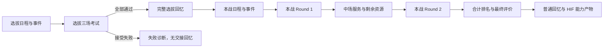

# HIF 全流程 Arena：Report 3 交付

2026-09-10，规则版本 `hif-report3/2`。**可按明确配置训练选拔 → 本战 Round 1 → 中场 → Round 2。** 推荐入口为 `create_hif_training_produce`，旧 `create_training_produce` 仍是兼容入口，不能仅改实验标签就视作新版。

**同日实机数据修正：**用户确认的三项采用 +9 元气、固定体力消耗 2、定制价格 100 P。前两项使用 `live-game-corrections/20260910-1` 卡目录补丁覆盖原上游错误引用；培育与 TrainingExam 一致，原始文件保留。[证据与说明](GOLDEN_DIFFERENCES_TO_VERIFY.md)。后文各历史验收保留其原 hash，不能代替此补丁版的新验收。

**同日最新修正：**PLv ≤ 76 普通卡的绿豆定制转接已补齐：160 张范围内可定制卡及 4 张扩展等级边界例、2,333 个合法有序配置转接及原生编译／开场零失败，52 项定制专项与 124 项相邻回归通过。主数据／golden 差异按既定 golden 优先规则处理并记录，见[绿豆修复与 RL 用法](HIF_CUSTOMIZATION_BRIDGE.md)。此项开训阻塞已解除，范围外未知定制仍明确报错。

此前 S4+ 攻略整链检查修复了支援历史等级叠加和开局随机补牌等问题，两把条件结果为 30,391 / 30,113（S4+），详见[当时的配置与证据](../build/hif_s4_guide_demo_20260910/README.md)。那十场快照以及本文原 712 项验收／旧 manifest 均保留各自源码版本，不作为本次绿豆修复后的重新模拟或全量验收证明。

考试继续由用户指定的 pinned gktools golden 执行；培育外层采用本地主数据和用户提供的 Report 3。报告未确定的抽样与少数经济细节采用带版本的可替换规划假设。这里的 ready 指这个环境可运行、可外部决策、可恢复、可追溯，不表示已还原游戏服务器所有随机概率。无需追加实机校准作为开训前置。



每场考试均可在接受结果前重试；恢复本场考前条件，只结算最终接受的一次结果。训练接口和状态边界见下文；所有精度差异集中在 [gap 清单](HIF_FULL_PRODUCE_GAPS.md)。

## 对照报告后的实现与取舍

| 报告内容 | 本版状态 | 修复或取舍 |
|---|---|---|
| 两剧本日程、3＋2 考试 | 已实现并贯通 | 默认安装日程与五场考试/NPC；`day_actions`、`exam_config` 仍可自定义，见 [五场课程](HIF_FIVE_EXAM_COURSES.md) |
| 课堂、外出、慰问品 | 已实现 | 92 事件/72 选项与来源核对；保留池差异后课堂为 27 组，外出为 3 种选项；头部费用、眠气先于收益执行 |
| 课堂数值与成本修正 | 已修正 | 固定加点不乘课程成长；`alwaysSuccessful` 与万分比正确；体力成本修正不再当即刻回复 |
| 公开课、SP | 已实现 | 主副属性分别吃成长；独立发选拔 30 P、本战 50 P；概率、主副 SP 联合模型、副属性选择仍为配置假设 |
| HIF 慰问品 | 已修正 | 基础 80 P，不走粉丝票追加 P 点；支援/道具的独立触发保留 |
| 支援事件与普通 P 道具 | 已接执行 | 511 条支援事件已实际执行两剧本×三计划共 3066 条路径；资源、强化、换卡、删除有结果断言；按编成/等级/前置顺序筛选 |
| 技能卡支援临时强化 | 已补齐 | 按实际六支援及等级触发；422 张卡的 844 个高阶变体、2532 组原生执行字段转换审计无失败；临时上限 +3、永久强化共存、成长保留、回合恢复，见 [技能卡支援](HIF_SKILL_CARD_SUPPORT.md) |
| 特殊 P 道具 | 已实现 | **180 配置、60 经济状态、171 进化边**；四种触发、三选进化、黄袋来源池、次数/冷却、自选操作、专用折扣与累积效果，见 [专项说明](HIF_REPORT3_PITEMS.md) |
| 下一场／永久考试附加效果 | 已修正 | 下一场效果只消费一次，永久累积继续携带；实际考试结算后消费，再处理结束触发 |
| HIF 回忆 | 已完成自动桥接 | **105/105**：26 再动、45 再动＋抽牌、34 去眠气；原卡/强化卡共用计数，首回合安装不重复，见 [回忆说明](HIF_MEMORY_ABILITIES.md) |
| 应援棒 | 已实现主数据加权 | 六组权重读取原始池；golden 原生 RNG 和插入负责执行，养成卡组不被补满；vendor 文件保持原字节，见 [权重说明](HIF_BATON_WEIGHTS.md) |
| 普通咨询 | 已补齐 | 报告价表、SALE、独立强化/删除计数、PLv 门槛；未知槽数/服务次数/刷新细节可配，见 [商店说明](HIF_REPORT3_SHOP.md) |
| 中场 | 已补齐 | 买卡、换卡、饮料、逐次 10 P→2 HP、强化、定制、刷新、结束；刷新恢复 1 张强化/2 张定制资格；无普通咨询触发 |
| 特别指导 | 已补齐 | 按两张不同卡计名额；同卡可合法定制多项，不重复重放旧定制 |
| 换卡 | 已修正 | Select Change 继承旧卡强化、丢弃定制；不误发 Get；空来源池保留原卡，不回退全局池 |
| Round 2 入场 | 已修正 | 中场结束后无自动回体；按实际剩余 HP/饮料进入下一场 |
| 选拔 → 本战 | 已扩展并验证 | 全部 loadout 输入冻结实际偶像/支援编成；三维、星性、最大 HP、完整卡片、道具次数、支援状态、已完成事件、修正与剩余刷新继承；P 点/饮料/当前 HP 按本战初始化，不直接复制 |
| 快照与版本 | 已实现 | 全局公共决策边界保存/恢复，包括库存、来源采样记录、RNG、计数；考试内用原生快照，见 [恢复指南](HIF_PRODUCE_CHECKPOINTS.md) |
| 同进程环境隔离 | 已修正 | 初始每张卡独立深拷贝，修改不会污染共享主数据或其他环境；实例 ID 持久化、重排保持、删卡后不复用，分配序号随快照与选拔交接保存 |
| 容量与非法操作 | 已接约束 | P 点 9999、卡组 99、最大 HP 999、饮料按主数据最多 4；满卡组的加眠气费用选项不可白拿收益；过期/非法行动拒绝 |

冲突处理采用“明确主数据/官方规则优先，社区数值表版本化，未知概率不冒充事实”。具体包括：HIF 复用带 NIA 后缀的特殊道具触发 ID 仍应触发；最高卡片折扣取当前 30%；Select Change 不按来源后缀强制降级；`SupportCardProduceCardUpgradeProbabilityUp` 不用于拿卡强化率；选拔仅前两场剧情各删除两张合法基本卡，第三场不额外删除。

## 本次补齐的完整培育边界

| 机制 | 执行方式与证据 |
|---|---|
| 五场默认考试 | 固定偶像类型、回合配额、实际属性/star、真实 NPC 组；[课程与近似表](HIF_FIVE_EXAM_COURSES.md) |
| 考试奖励与评价 | 五条独立星性曲线、native 分色得分分配三维、R1 P 点、实际 post-R2 star 评价；接受结果只入账一次 |
| 失败／重试／放弃 | 恢复本场考前资源和次数，R2 不撤销中场；共享三次额度，可配置免费/券钱包；[生命周期](HIF_LIFECYCLE.md) |
| 考试入口 | 无虚构咨询触发；强制回体应用成长盘修正，R2 不自动回复 |
| 最终回忆 | 最终持有卡组、普通＋HIF能力、初次一份、票据再生成后择一；失败选拔/放弃不发回忆 |
| 快照原子性 | 非法或失败操作回滚，不留下扣费半链；新规则 hash 包含考试研究数据 |
| 奖励重抽／排除／Switch | 多来源共享控制次数、保持来源与升级约束；Switch 复用开局账户转换，见 [事件闭包](HIF_EVENT_CLOSURE.md) |

## 开训配置与接口

可运行最小例子见 [验证脚本](../scripts/validate_hif_report3.py)。以下三个策略边界均由训练方决定：

```python
from gakumas_arena.produce import create_hif_training_produce

run = create_hif_training_produce(
    scenario='hif_selection', seed=23, loadout=my_loadout,
    exam_config=my_exam_config,       # 可省略：默认五场课程；也可完整自定义
    exam_policy=my_exam_policy,       # golden 的用卡、饮料、嵌套选牌、结束
    produce_choice_selector=my_choice,# 返回 request['options'] 中的整数下标
    research_config=my_research_config,
)
while not run.observe()['terminated']:
    obs = run.observe()
    run.act(my_produce_policy(obs))   # 必须提交当前 obs['actions'] 的完整候选

memory = run.runtime.export_hif_selection_memory()
final_run = create_hif_training_produce(
    scenario='hif_final', selection_memory=memory, seed=24,
    exam_config=my_exam_config, exam_policy=my_exam_policy,
    produce_choice_selector=my_choice, research_config=my_research_config,
)
```

`my_*` 是调用方配置/策略，不是仓库内置对象。直接执行脚本可跑通示例，不需要自行补变量。新入口要求内部选择回调，避免偷偷替 RL 选卡。请求含 `kind/options/context/choice_id/step/public_state`；`public_state` 是效果链当前公开资源、牌组、道具、支援与附加状态。事件费用可能已支付，不能在回调中读取旧的外层缓存代替它。`skip` 候选表示主动放弃；随机操作仍由环境 RNG 执行。

**这是同步策略回调环境。** 全局可在一次 `act` 返回后的决策边界保存；不保存 Python 回调调用栈。考试本身支持嵌套选择暂停/恢复。内部选择模型在回调内记录样本，恢复时重新挂接同配置策略及其自有状态。

```python
saved = run.snapshot()                 # JSON-safe，含私有 RNG，勿传策略网络
same_config_fresh_run.restore_snapshot(saved)
record = run.export_run()              # 诊断轨迹，含来源采样历史，不是 checkpoint
```

单独训练 Round 2 继续用 `TrainingExam` / `hif_round2_entry`，不必重跑选拔。三维／star 换算使用已接受的 [研究公式](HIF_SCORING_MODEL.md)。省略 `exam_config` 使用五场默认课程；自定义时仍可逐场提供回合顺序、曲线族、达标策略和对手配置。合成示例的回合顺序、零对手或全达标不代表官方难度。

目标读 `exam_history[-1]['result']['exam_score']`；两轮合计看 `state['hif_combined_score']`。旧外层 shaped reward 仅保留兼容，不应自动用于 RL 目标。`fault`、未支持内容、外部截断不产生正常 0 分标签。

## 当前规划假设

| 项目 | 默认模型／替换入口 |
|---|---|
| 未公开的奖励池 | 每个 `pool_id` 独立配置 `pools[pool_id].weights`；缺省在合法集合均匀抽样，记录 `evidence=unknown`；不代表不同池真实分布相同 |
| 普通奖励强化率 | 源池 `upgrade_probability`；缺省 0 是规划假设，不读取技能卡 support 发生率 |
| 支援事件出现 | 每日合法集合 Bernoulli 0.25 后均匀选 1；`support_event_probability` 或自定义 `event_sampler` 可替换。协议出现率修正不能反推出服务器基础概率 |
| 技能卡支援出现 | 每来源基础率 ×（1＋自身已解锁技能相对增幅）；编成顺序独立判定、均匀合法手牌、回合开始预约后生效。概率可逐来源覆盖，具体单位与配置见技能卡支援文档 |
| SP | `sp_base_rate=0.10`，主副按独立边缘概率；`sub_stat_policy='lowest'`，可配置，不声称真实日程副属性一定如此 |
| 进化四选三 | 合法四分支均匀展示三项；可替换 `customize_item_offer_selector` |
| 普通咨询 | 默认 4 卡＋4 饮料、每类服务 1 次/visit、刷新不重开服务，价格尾端保持 250；完整 `consult_*` 参数见商店文档 |
| 中场 | 4 买卡＋2 换卡＋2 饮料；刷新价 10/10/20/30/40/50，尾端保持 50；每次强化后基价加 25。SSR 是否强化默认 Bernoulli 0.5，可用 `interval_ssr_upgrade_probability` 或池配置替换 |
| 数值取整 | 属性每次增量向下取整，HP/P 点在公共决策边界向下取整；价格用十进制乘算后 floor，避免浮点少扣/多扣 1。尚未识别的完整取整顺序属于版本化规划约定 |

公开观察 `sampling_scope`、导出 `sampling` 与 checkpoint 中的规则/主数据/源码 hash 一起保存。缺额、空槽、主动放弃均记实际结果；非法权重或未知 ID 明确报错。

25% `stepSkip` 已提供 `enable_step_skip=True` 规划开关；默认关闭，因为未找到 HIF 普通菜单直接提供它的证据。最终回忆生成/筛选、再生成票与交接资格已实现，见 [回忆产物](HIF_MEMORY_GENERATION.md)。普通 snapshot/fork 不是公平搜索的隐藏状态条件采样。服务器概率与逐条实机验收不作为当前模型的精确性声明。

## 验证产物

**最终验收：712 passed，0 failed，1 skipped**（2026-09-10）。[统一 ready manifest](../build/hif_report3/ready_v2_manifest.json) 汇总入口、规则/源码/主数据 hash、三套集成记录与测试结果。唯一跳过项为旧兼容路径 `test_pre_audition_shop_action_reports_pbrs_reward`：该种子没有可执行的考试前准备动作；新版 HIF 检查无跳过。74 份 pinned golden 原始文件逐字节保持不变。

```powershell
Set-Location C:/Users/Liu/Documents/ChatGPT/gakumas/third_party/gakumas_arena
.venv/Scripts/python.exe scripts/validate_hif_report3.py
.venv/Scripts/python.exe scripts/validate_hif_report3.py --research-scoring --output build/hif_report3/research_formula
.venv/Scripts/python.exe scripts/validate_hif_report3.py --default-courses --output build/hif_report3/default_courses
$hifTests = @(rg --files tests -g 'test_hif*.py')
$otherTests = @('tests/test_produce_golden.py', 'tests/test_produce_checkpoint.py', 'tests/test_produce_card_identity.py', 'tests/test_skill_card_support.py', 'tests/test_training_custom.py', 'tests/test_training_engine.py', 'tests/test_golden_engine.py', 'tests/test_loadouts.py', 'tests/gakumas_rl/test_produce_reward_generalization.py', 'tests/gakumas_rl/test_recorded_games.py', 'tests/gakumas_rl/test_rules.py', 'tests/gakumas_rl/test_pending_choices.py', 'tests/gakumas_rl/test_idol_kit.py', 'tests/gakumas_rl/test_memory_runtime_bridge.py')
.venv/Scripts/python.exe -X utf8 -m pytest @hifTests @otherTests --junitxml=build/hif_report3/pytest_v2.xml -q
```

- [3＋2 集成证据](../build/hif_report3/demo/manifest.json)：每场入场/终局快照、全局轨迹、选拔交接包、来源版本；两阶段全局恢复和五场考试恢复一致。
- [研究公式整链证据](../build/hif_report3/research_formula/manifest.json)：实际读取每场三维/star，经研究模型换算，再由 golden 打分；课程明确为合成配置。
- [默认课程证据](../build/hif_report3/default_courses/manifest.json)：实际五场配置入口及 NPC 模型；本示例策略在第一场选拔落败并正常结束，未伪造通过或生成不合法交接。五个阶段分别实际执行的检查见 `tests/test_hif_courses.py`。
- [技能卡支援审计](research/hif_skill_card_support_audit_20260910.json)：844 个高阶变体、2532 组执行字段，逐变体记录和源码 hash；可用 `scripts/audit_skill_card_support.py` 复跑。
- [本版完整回归 XML](../build/hif_report3/pytest_v2.xml)：712 通过、1 个明确原因的兼容测试跳过；包括七条实例身份隔离回归、三场景固定回忆加点与课程成长对照。
- [上一版回归 XML](../build/hif_report3/pytest.xml)：`hif-report3/1` 的 **310 passed，0 failures**；本版新增机制的验收记录另列，不相加重复专项用例数量。
- [原始研究包](research/imports/hif_events_rl_report3_2026-09-09/README.md)：5 个文件 SHA-256 校验；原报告与目录保留，不改写研究证据。

以上验证不启动 RL 训练、游戏或 Maa。
